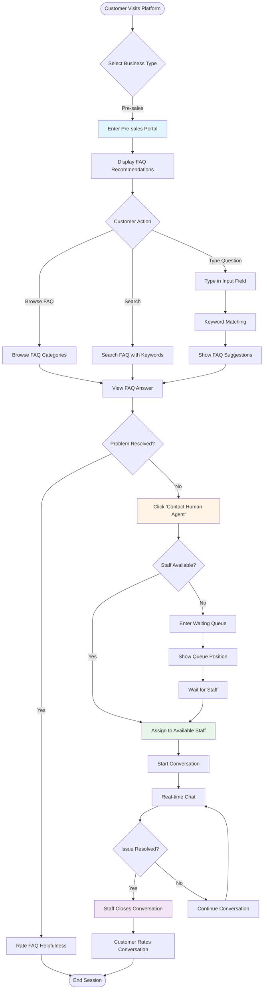
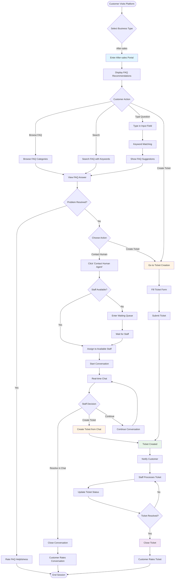
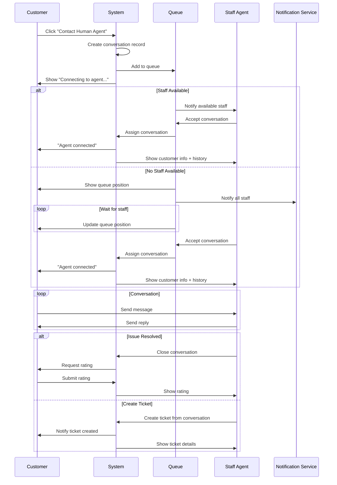
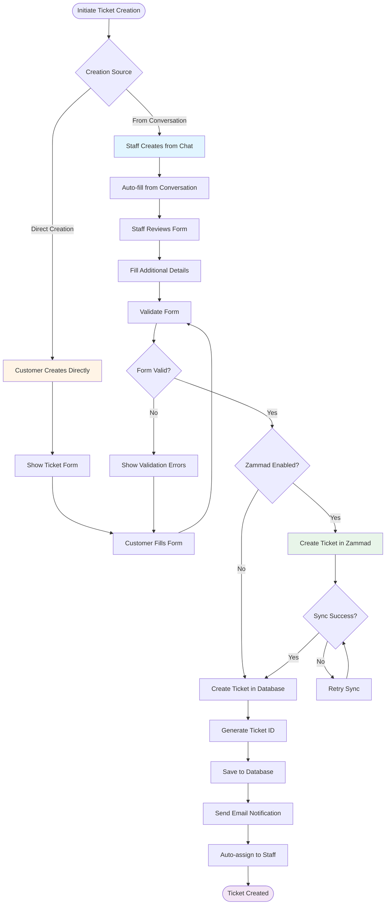
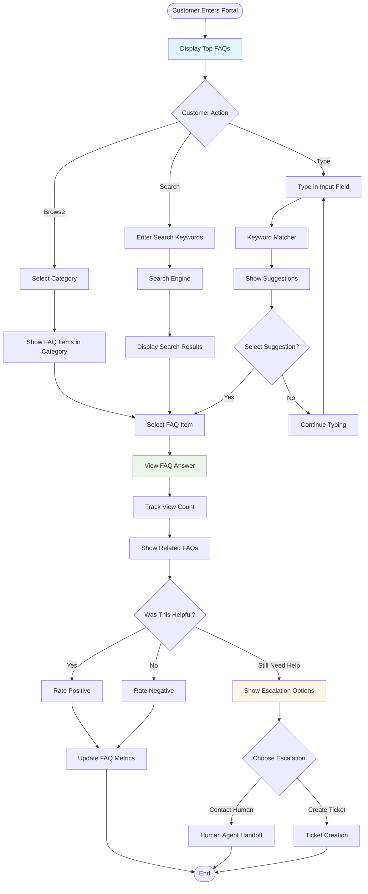
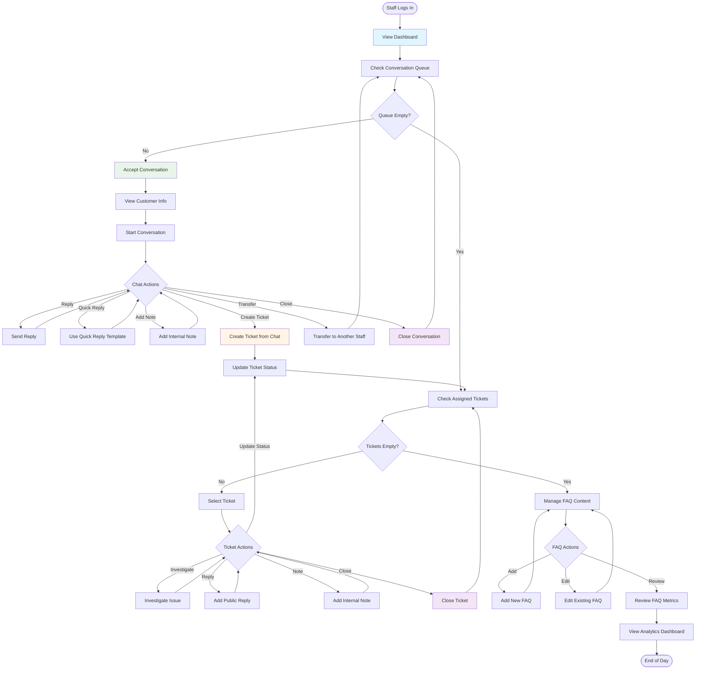

# 🔄 Business Flows

> Detailed business process flows for the Customer Service Platform

**Document Version**: 1.0  
**Last Updated**: 2025-10-27  
**Status**: ✅ Complete

---

## Table of Contents

1. [Overview](#overview)
2. [Pre-sales Consultation Flow](#pre-sales-consultation-flow)
3. [After-sales Support Flow](#after-sales-support-flow)
4. [Human Agent Handoff Flow](#human-agent-handoff-flow)
5. [Ticket Creation Flow](#ticket-creation-flow)
6. [FAQ Self-Service Flow](#faq-self-service-flow)
7. [Staff Workflow](#staff-workflow)

---

## 1. Overview

This document describes the core business processes of the Customer Service Platform. Each flow is illustrated with Mermaid diagrams and detailed step-by-step descriptions.

### Key Principles

1. **Customer-First**: Minimize friction in customer journey
2. **Self-Service Priority**: Encourage FAQ usage before human handoff
3. **Contextual Handoff**: Preserve conversation history when escalating
4. **Flexible Routing**: Support both automatic and manual assignment
5. **Continuous Improvement**: Track metrics to optimize flows

---

## 2. Pre-sales Consultation Flow

### 2.1 Flow Diagram



### 2.2 Detailed Steps

#### Phase 1: Entry and Self-Service
1. **Customer visits platform** → Lands on homepage
2. **Selects "Pre-sales Consultation"** → Enters pre-sales portal
3. **Views FAQ recommendations** → System shows top 5 relevant FAQs based on business type
4. **Customer chooses action**:
   - **Option A**: Browse FAQ categories
   - **Option B**: Search FAQ with keywords
   - **Option C**: Type question in input field

#### Phase 2: FAQ Interaction
5. **If browsing**: Navigate through categories → Select FAQ item → View answer
6. **If searching**: Enter keywords → View search results → Select FAQ item → View answer
7. **If typing**: System performs real-time keyword matching → Shows suggestions → Customer clicks suggestion → View answer

#### Phase 3: Resolution or Escalation
8. **Problem resolved?**
   - **Yes**: Customer rates FAQ helpfulness → Session ends
   - **No**: Customer clicks "Contact Human Agent" → Proceed to Phase 4

#### Phase 4: Human Agent Handoff
9. **System checks staff availability**:
   - **Staff available**: Immediately assign conversation
   - **No staff available**: Add to waiting queue → Show queue position
10. **Staff accepts conversation** → Conversation starts
11. **Real-time chat** → Staff provides assistance
12. **Issue resolved** → Staff closes conversation
13. **Customer rates conversation** → Session ends

### 2.3 Business Rules

| Rule | Description |
|------|-------------|
| **BR-PS-001** | Pre-sales customers **cannot** create tickets |
| **BR-PS-002** | FAQ must be shown before allowing human handoff |
| **BR-PS-003** | Conversation history is preserved when escalating to human agent |
| **BR-PS-004** | Maximum queue wait time: 5 minutes (configurable) |
| **BR-PS-005** | If wait time exceeds limit, offer callback option |

---

## 3. After-sales Support Flow

### 3.1 Flow Diagram



### 3.2 Detailed Steps

#### Phase 1: Entry and Self-Service
1. **Customer visits platform** → Lands on homepage
2. **Selects "After-sales Support"** → Enters after-sales portal
3. **Views FAQ recommendations** → System shows top 5 relevant FAQs
4. **Customer chooses action**:
   - **Option A**: Browse FAQ categories
   - **Option B**: Search FAQ with keywords
   - **Option C**: Type question in input field
   - **Option D**: Directly create ticket (skip FAQ)

#### Phase 2: FAQ Interaction (if chosen)
5-7. Same as Pre-sales flow

#### Phase 3: Resolution or Escalation
8. **Problem resolved?**
   - **Yes**: Customer rates FAQ helpfulness → Session ends
   - **No**: Customer chooses next action:
     - **Option A**: Contact human agent
     - **Option B**: Create ticket

#### Phase 4A: Human Agent Path
9-13. Same as Pre-sales flow
14. **During conversation, staff can**:
    - Resolve issue in chat → Close conversation
    - Create ticket from chat → Proceed to Phase 5
    - Continue conversation

#### Phase 4B: Direct Ticket Creation
15. **Customer fills ticket form**:
    - Title, description, priority, category
    - Attach files (screenshots, logs)
16. **Submit ticket** → Proceed to Phase 5

#### Phase 5: Ticket Processing
17. **Ticket created** → System generates ticket ID
18. **Notify customer** → Email + in-app notification
19. **Staff processes ticket**:
    - Investigate issue
    - Add internal notes
    - Update status (new → in-progress → resolved)
    - Add public replies
20. **Ticket resolved?**
    - **No**: Continue processing
    - **Yes**: Close ticket
21. **Customer rates ticket resolution** → Session ends

### 3.3 Business Rules

| Rule | Description |
|------|-------------|
| **BR-AS-001** | After-sales customers **can** create tickets |
| **BR-AS-002** | Tickets can be created from conversations or directly |
| **BR-AS-003** | Conversation history is attached to tickets created from chat |
| **BR-AS-004** | Customers receive email notifications for ticket updates |
| **BR-AS-005** | Tickets must have SLA (Service Level Agreement) targets |
| **BR-AS-006** | High-priority tickets are auto-escalated if not resolved in 24h |

---

## 4. Human Agent Handoff Flow

### 4.1 Flow Diagram



### 4.2 Queue Management

#### Queue Priority Rules
1. **VIP customers**: Priority 1 (highest)
2. **Long wait time**: Priority 2 (>3 minutes)
3. **Regular customers**: Priority 3 (FIFO)

#### Auto-Assignment Logic
```
IF staff.status == 'available' AND staff.current_conversations < max_concurrent THEN
    ASSIGN conversation TO staff
    SET staff.status = 'busy'
ELSE
    ADD conversation TO queue
    NOTIFY all available staff
END IF
```

---

## 5. Ticket Creation Flow

### 5.1 Flow Diagram



### 5.2 Ticket Form Fields

| Field | Type | Required | Validation |
|-------|------|----------|------------|
| Title | Text | Yes | 10-200 characters |
| Description | Textarea | Yes | 50-5000 characters |
| Category | Select | Yes | Predefined list |
| Priority | Select | Yes | Low / Medium / High / Urgent |
| Attachments | File | No | Max 5 files, 10MB each |
| Customer Email | Email | Yes | Valid email format |
| Customer Name | Text | Yes | 2-100 characters |

### 5.3 Auto-Assignment Rules

```
IF ticket.priority == 'Urgent' THEN
    ASSIGN TO senior_staff WITH least_active_tickets
ELSE IF ticket.category == 'Technical' THEN
    ASSIGN TO technical_team WITH least_active_tickets
ELSE
    ASSIGN TO general_team WITH least_active_tickets
END IF
```

---

## 6. FAQ Self-Service Flow

### 6.1 Flow Diagram



### 6.2 Keyword Matching Algorithm

```
FUNCTION matchKeywords(userInput):
    keywords = extractKeywords(userInput)
    matches = []
    
    FOR EACH keyword IN keywords:
        faqItems = database.query("SELECT * FROM faq_keywords WHERE keyword LIKE ?", keyword)
        FOR EACH item IN faqItems:
            score = calculateRelevanceScore(keyword, item)
            matches.add({item, score})
        END FOR
    END FOR
    
    SORT matches BY score DESC
    RETURN top 5 matches
END FUNCTION
```

### 6.3 Search Ranking Factors

| Factor | Weight | Description |
|--------|--------|-------------|
| Exact keyword match | 40% | Keyword appears in question/answer |
| Partial match | 20% | Keyword partially matches |
| View count | 15% | Popular FAQs ranked higher |
| Positive ratings | 15% | Highly rated FAQs ranked higher |
| Recency | 10% | Recently updated FAQs ranked higher |

---

## 7. Staff Workflow

### 7.1 Daily Workflow Diagram



### 7.2 Staff Performance Metrics

| Metric | Target | Measurement |
|--------|--------|-------------|
| Average Response Time | <30 seconds | Time from customer message to first staff reply |
| Average Resolution Time | <10 minutes | Time from conversation start to close |
| Conversations per Day | >20 | Total conversations handled |
| Customer Satisfaction | >4.5/5 | Average rating from customers |
| First Contact Resolution | >70% | % of issues resolved in first conversation |
| Ticket Resolution Time | <24 hours | Average time to resolve tickets |

---

## 8. Exception Handling

### 8.1 System Failures

| Scenario | Handling |
|----------|----------|
| WebSocket disconnection | Auto-reconnect with exponential backoff |
| Database timeout | Retry 3 times, then show error message |
| Zammad API failure | Create ticket locally, sync later |
| File upload failure | Show error, allow retry |
| Staff unavailable (>5 min wait) | Offer callback or ticket creation |

### 8.2 Business Exceptions

| Scenario | Handling |
|----------|----------|
| Customer closes browser during conversation | Save conversation state, allow resume |
| Staff goes offline during conversation | Auto-transfer to another available staff |
| Duplicate ticket creation | Detect and merge duplicates |
| Invalid file upload | Validate file type and size, show error |
| Spam detection | Rate limit, CAPTCHA, block IP |

---

**Document Status**: ✅ Complete  
**Next Review**: 2025-11-10  
**Approved By**: TBD

