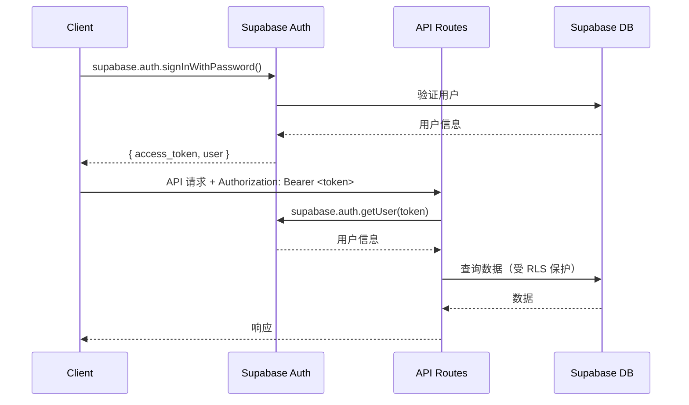

# 🔌 API 设计

> Customer Service Platform - 基于 Supabase Auth + Zammad API 的混合架构

**文档版本**: 2.0 (Supabase + Zammad 集成版)
**最后更新**: 2025-10-28
**状态**: ✅ 完成

> **📝 架构升级**: 本文档基于 Supabase + Zammad 集成方案重新设计，使用 Supabase Auth 替代自建认证端点，使用 Zammad API 替代自建工单端点。
> 详见 [SUPABASE-ZAMMAD-INTEGRATION-ANALYSIS.md](./SUPABASE-ZAMMAD-INTEGRATION-ANALYSIS.md)。

---

## 目录

1. [概述](#概述)
2. [认证方式](#认证方式)
3. [API 端点](#api-端点)
4. [Webhook 集成](#webhook-集成)
5. [错误处理](#错误处理)
6. [速率限制](#速率限制)

---

## 1. 概述

### 1.1 API 设计原则

1. **现成服务优先**: 使用 Supabase Auth SDK 和 Zammad API
2. **RESTful 风格**: 标准 HTTP 方法（GET, POST, PUT, DELETE）
3. **无状态**: JWT token 认证（由 Supabase 管理）
4. **统一响应格式**: `{ success, data, error }`
5. **版本控制**: URL 路径版本控制（/api/v1/...）

### 1.2 技术栈

| 技术 | 用途 |
|------|------|
| **Next.js 14 App Router** | API Routes 框架 |
| **Supabase Auth** | 用户认证（替代自建 JWT） |
| **Zammad API** | 工单管理（替代自建工单端点） |
| **Zod** | 数据验证 |
| **Socket.IO** | 实时通信（打字指示器等） |

### 1.3 基础 URL

```
开发环境: http://localhost:3000/api/v1
生产环境: https://your-domain.com/api/v1
```

### 1.4 通用响应格式

**成功响应**: `{ success: true, data: {...} }`  
**错误响应**: `{ success: false, error: "...", code: "..." }`

---

## 2. 认证方式

### 2.1 Supabase Auth 认证流程



### 2.2 认证方式对比

| 功能 | 旧架构（自建 JWT） | 新架构（Supabase Auth） |
|------|------------------|----------------------|
| **用户注册** | `POST /api/v1/auth/register` | ✅ `supabase.auth.signUp()` |
| **用户登录** | `POST /api/v1/auth/login` | ✅ `supabase.auth.signInWithPassword()` |
| **Token 验证** | `GET /api/v1/auth/verify` | ✅ `supabase.auth.getUser(token)` |
| **密码重置** | `POST /api/v1/auth/reset-password` | ✅ `supabase.auth.resetPasswordForEmail()` |
| **社交登录** | ❌ 不支持 | ✅ `supabase.auth.signInWithOAuth()` |
| **MFA** | ❌ 不支持 | ✅ `supabase.auth.mfa.*` |

### 2.3 中间件实现

**旧架构**: 自建 JWT 验证中间件（bcrypt + jsonwebtoken）  
**新架构**: Supabase Auth 中间件（`supabase.auth.getUser()`）

**请求头**: `Authorization: Bearer <supabase_access_token>`

---

## 3. API 端点

### 3.1 端点概览

| 分类 | 端点数量 | 说明 |
|------|---------|------|
| **认证** | 0 个 | ✅ 使用 Supabase Auth SDK |
| **业务类型** | 1 个 | 获取业务类型列表 |
| **对话管理** | 5 个 | 创建、查询、更新对话 |
| **消息管理** | 3 个 | 发送、查询消息 |
| **FAQ** | 4 个 | 查询 FAQ、分类、搜索 |
| **客户标签** | 3 个 | 添加、删除、查询标签 |
| **工单** | 0 个 | ✅ 使用 Zammad API |
| **Webhook** | 1 个 | 接收 Zammad 事件 |
| **总计** | **17 个** | 删除 10+ 个端点 |

### 3.2 业务类型 API

#### GET /api/v1/business-types

**用途**: 获取业务类型列表（售前、售后等）

**认证**: 不需要

**查询参数**:

| 参数 | 类型 | 必需 | 说明 |
|------|------|------|------|
| `locale` | string | 否 | 语言代码（en, zh-CN, fr, es, ru, pt），默认 en |

**响应字段**:

| 字段 | 类型 | 说明 |
|------|------|------|
| `id` | UUID | 业务类型 ID |
| `code` | string | 业务类型代码（pre_sales, after_sales） |
| `name` | string | 业务类型名称（根据 locale 返回） |
| `allow_tickets` | boolean | 是否允许创建工单 |
| `is_active` | boolean | 是否激活 |

**示例响应**:

```json
{
  "success": true,
  "data": [
    {
      "id": "uuid-1",
      "code": "pre_sales",
      "name": "售前咨询",
      "allow_tickets": false,
      "is_active": true
    },
    {
      "id": "uuid-2",
      "code": "after_sales",
      "name": "售后支持",
      "allow_tickets": true,
      "is_active": true
    }
  ]
}
```

### 3.3 对话管理 API

#### GET /api/v1/conversations

**用途**: 获取对话列表

**认证**: 必需（Supabase Auth JWT）

**查询参数**:

| 参数 | 类型 | 必需 | 说明 |
|------|------|------|------|
| `status` | string | 否 | 对话状态（active, waiting, closed） |
| `limit` | integer | 否 | 每页数量，默认 20，最大 100 |
| `offset` | integer | 否 | 偏移量，默认 0 |

**RLS 保护**: 客户只能查看自己的对话，员工可以查看分配的对话，管理员可以查看所有对话

**响应字段**:

| 字段 | 类型 | 说明 |
|------|------|------|
| `id` | UUID | 对话 ID |
| `business_type_id` | UUID | 业务类型 ID |
| `customer_id` | UUID | 客户 ID |
| `staff_id` | UUID | 员工 ID（可能为 null） |
| `status` | string | 对话状态 |
| `message_count` | integer | 消息数量 |
| `started_at` | timestamp | 开始时间 |
| `ended_at` | timestamp | 结束时间（可能为 null） |

---

#### POST /api/v1/conversations

**用途**: 创建新对话

**认证**: 必需

**请求体**:

| 字段 | 类型 | 必需 | 说明 |
|------|------|------|------|
| `business_type_id` | UUID | 是 | 业务类型 ID |
| `initial_message` | string | 否 | 初始消息内容 |

**RLS 保护**: 客户只能创建自己的对话（`customer_id = auth.uid()`）

---

#### GET /api/v1/conversations/:id

**用途**: 获取对话详情

**认证**: 必需

**RLS 保护**: 只能访问自己参与的对话

---

#### PUT /api/v1/conversations/:id

**用途**: 更新对话状态

**认证**: 必需

**请求体**:

| 字段 | 类型 | 必需 | 说明 |
|------|------|------|------|
| `status` | string | 否 | 对话状态（active, waiting, closed） |
| `staff_id` | UUID | 否 | 分配员工 ID（仅员工/管理员） |

**RLS 保护**: 员工和管理员可以更新对话

---

#### DELETE /api/v1/conversations/:id

**用途**: 删除对话（软删除）

**认证**: 必需（仅管理员）

**RLS 保护**: 仅管理员可以删除

### 3.4 消息管理 API

#### GET /api/v1/conversations/:id/messages

**用途**: 获取对话消息列表

**认证**: 必需

**查询参数**:

| 参数 | 类型 | 必需 | 说明 |
|------|------|------|------|
| `limit` | integer | 否 | 每页数量，默认 50，最大 200 |
| `offset` | integer | 否 | 偏移量，默认 0 |
| `order` | string | 否 | 排序方式（asc, desc），默认 asc |

**RLS 保护**: 继承 conversations 的权限（通过 conversation_id）

**响应字段**:

| 字段 | 类型 | 说明 |
|------|------|------|
| `id` | UUID | 消息 ID |
| `conversation_id` | UUID | 对话 ID |
| `sender_id` | UUID | 发送者 ID |
| `content` | string | 消息内容 |
| `metadata` | object | 附加数据（文件、图片等） |
| `created_at` | timestamp | 创建时间 |

---

#### POST /api/v1/conversations/:id/messages

**用途**: 发送消息

**认证**: 必需

**请求体**:

| 字段 | 类型 | 必需 | 说明 |
|------|------|------|------|
| `content` | string | 是 | 消息内容（1-5000 字符） |
| `metadata` | object | 否 | 附加数据（文件 URL、图片 URL 等） |

**RLS 保护**: 只能在自己参与的对话中发送消息

**实时通知**: 发送成功后，通过 Supabase Realtime 通知对话参与者

---

#### GET /api/v1/messages/:id

**用途**: 获取单条消息详情

**认证**: 必需

**RLS 保护**: 只能访问自己参与的对话中的消息

### 3.5 FAQ API

#### GET /api/v1/faq/categories

**用途**: 获取 FAQ 分类树（树形结构）

**认证**: 不需要

**查询参数**:

| 参数 | 类型 | 必需 | 说明 |
|------|------|------|------|
| `locale` | string | 否 | 语言代码（en, zh-CN, fr, es, ru, pt），默认 en |

**响应**: 树形结构的分类列表，包含子分类

---

#### GET /api/v1/faq/items

**用途**: 获取 FAQ 列表

**认证**: 不需要

**查询参数**:

| 参数 | 类型 | 必需 | 说明 |
|------|------|------|------|
| `locale` | string | 否 | 语言代码，默认 en |
| `category_id` | UUID | 否 | 分类 ID（筛选） |
| `limit` | integer | 否 | 每页数量，默认 20 |
| `offset` | integer | 否 | 偏移量，默认 0 |

**响应字段**:

| 字段 | 类型 | 说明 |
|------|------|------|
| `id` | UUID | FAQ ID |
| `category_id` | UUID | 分类 ID |
| `question` | string | 问题（根据 locale 返回） |
| `answer` | string | 答案（根据 locale 返回） |
| `view_count` | integer | 查看次数 |
| `helpful_count` | integer | 有帮助次数 |

---

#### GET /api/v1/faq/items/:id

**用途**: 获取 FAQ 详情

**认证**: 不需要

**查询参数**: `locale`

**副作用**: 自动增加 `view_count`

---

#### GET /api/v1/faq/search

**用途**: 搜索 FAQ（关键词匹配 + 全文搜索）

**认证**: 不需要

**查询参数**:

| 参数 | 类型 | 必需 | 说明 |
|------|------|------|------|
| `keyword` | string | 是 | 搜索关键词 |
| `locale` | string | 否 | 语言代码，默认 en |
| `limit` | integer | 否 | 返回数量，默认 10 |

**搜索逻辑**:
1. 关键词表匹配（`keywords` 表）
2. 全文搜索（`faq_translations.content`）
3. 按权重和相关性排序

**多语言支持**: 支持 6 种语言（EN, ZH-CN, FR, ES, RU, PT）

### 3.6 客户标签 API

#### GET /api/v1/customer-tags/:customer_id

**用途**: 获取客户的所有标签

**认证**: 必需

**RLS 保护**: 员工和管理员可以查看，客户可以查看自己的标签

**响应字段**:

| 字段 | 类型 | 说明 |
|------|------|------|
| `id` | UUID | 标签 ID |
| `customer_id` | UUID | 客户 ID |
| `tag` | string | 标签名称 |
| `created_by` | UUID | 创建者 ID（员工） |
| `created_at` | timestamp | 创建时间 |

---

#### POST /api/v1/customer-tags

**用途**: 为客户添加标签

**认证**: 必需（仅员工和管理员）

**请求体**:

| 字段 | 类型 | 必需 | 说明 |
|------|------|------|------|
| `customer_id` | UUID | 是 | 客户 ID |
| `tag` | string | 是 | 标签名称（1-50 字符） |

**RLS 保护**: 仅员工和管理员可以添加标签

**唯一约束**: `(customer_id, tag)` 复合唯一索引，防止重复标签

---

#### DELETE /api/v1/customer-tags/:id

**用途**: 删除客户标签

**认证**: 必需（仅员工和管理员）

**RLS 保护**: 仅员工和管理员可以删除标签

### 3.7 Zammad API 集成（替代自建工单端点）

#### 工单创建流程

1. 客户在对话中请求创建工单
2. 调用 Zammad API 创建工单
3. 在本地 `zammad_sync` 表存储工单引用
4. 返回工单信息给客户

#### Zammad API 端点映射

| 功能 | Zammad API | 说明 |
|------|-----------|------|
| **创建工单** | `POST /api/v1/tickets` | 从对话升级为工单 |
| **查询工单** | `GET /api/v1/tickets/:id` | 获取工单详情 |
| **搜索工单** | `GET /api/v1/tickets/search?query=...` | 全文搜索工单 |
| **更新工单** | `PUT /api/v1/tickets/:id` | 更新状态、优先级等 |
| **添加回复** | `POST /api/v1/ticket_articles` | 添加工单回复 |
| **添加标签** | `POST /api/v1/tags/add` | 为工单添加标签 |
| **SLA 管理** | Zammad 内置 | 自动计算响应时间 |

#### Zammad API 认证

**请求头**: `Authorization: Token token=<ZAMMAD_API_TOKEN>`

**环境变量**: `ZAMMAD_URL`, `ZAMMAD_API_TOKEN`

#### 本地同步表（zammad_sync）

| 字段 | 说明 |
|------|------|
| `conversation_id` | 关联本地对话 |
| `zammad_ticket_id` | Zammad 工单 ID |
| `zammad_ticket_number` | Zammad 工单号（如 #12345） |
| `status` | 工单状态（同步自 Zammad） |
| `synced_at` | 最后同步时间 |

---

### 3.8 删除的端点（使用外部服务替代）

#### 认证端点（使用 Supabase Auth SDK）

| 旧端点 | 替代方案 |
|--------|---------|
| `POST /api/v1/auth/register` | ✅ `supabase.auth.signUp()` |
| `POST /api/v1/auth/login` | ✅ `supabase.auth.signInWithPassword()` |
| `GET /api/v1/auth/verify` | ✅ `supabase.auth.getUser()` |
| `POST /api/v1/auth/logout` | ✅ `supabase.auth.signOut()` |
| `POST /api/v1/auth/refresh` | ✅ `supabase.auth.refreshSession()` |
| `POST /api/v1/auth/reset-password` | ✅ `supabase.auth.resetPasswordForEmail()` |

#### 工单端点（使用 Zammad API）

| 旧端点 | 替代方案 |
|--------|---------|
| `POST /api/v1/tickets` | ✅ Zammad `POST /api/v1/tickets` |
| `GET /api/v1/tickets` | ✅ Zammad `GET /api/v1/tickets` |
| `GET /api/v1/tickets/:id` | ✅ Zammad `GET /api/v1/tickets/:id` |
| `PUT /api/v1/tickets/:id` | ✅ Zammad `PUT /api/v1/tickets/:id` |
| `POST /api/v1/tickets/:id/articles` | ✅ Zammad `POST /api/v1/ticket_articles` |
| `POST /api/v1/tickets/:id/tags` | ✅ Zammad `POST /api/v1/tags/add` |

---

## 4. Webhook 集成

### 4.1 Zammad Webhook 端点

| 方法 | 端点 | 认证 | 用途 |
|------|------|------|------|
| POST | `/api/v1/webhooks/zammad` | Webhook Secret | 接收 Zammad 工单事件 |

### 4.2 Webhook 事件类型

| 事件 | 说明 | 处理逻辑 |
|------|------|---------|
| `ticket.create` | 工单创建 | 更新 `zammad_sync` 表 |
| `ticket.update` | 工单更新 | 同步状态到本地 |
| `ticket.close` | 工单关闭 | 更新对话状态为 closed |
| `ticket.article.create` | 工单回复 | 通知客户（Socket.IO） |

### 4.3 Webhook 安全

**验证方式**: Webhook Secret（环境变量 `ZAMMAD_WEBHOOK_SECRET`）  
**请求头**: `X-Zammad-Signature`

---

## 5. 错误处理

### 5.1 标准错误码

| HTTP 状态码 | 错误码 | 说明 |
|-----------|--------|------|
| 400 | `VALIDATION_ERROR` | 请求参数验证失败 |
| 401 | `UNAUTHORIZED` | 未认证或 token 无效 |
| 403 | `FORBIDDEN` | 权限不足（RLS 拒绝） |
| 404 | `NOT_FOUND` | 资源不存在 |
| 409 | `CONFLICT` | 资源冲突（如重复创建） |
| 429 | `RATE_LIMIT_EXCEEDED` | 超过速率限制 |
| 500 | `INTERNAL_ERROR` | 服务器内部错误 |
| 502 | `EXTERNAL_SERVICE_ERROR` | 外部服务错误（Zammad） |

### 5.2 错误响应格式

```json
{
  "success": false,
  "error": "Validation failed",
  "code": "VALIDATION_ERROR",
  "details": {
    "field": "email",
    "message": "Invalid email format"
  }
}
```

---

## 6. 速率限制

### 6.1 速率限制策略

| 用户类型 | 限制 | 窗口 |
|---------|------|------|
| **未认证** | 20 请求 | 1 分钟 |
| **客户** | 100 请求 | 1 分钟 |
| **员工** | 200 请求 | 1 分钟 |
| **管理员** | 无限制 | - |

### 6.2 实现方式

**旧架构**: Redis 分布式速率限制  
**新架构**: 内存 Map（<50 并发足够）

**响应头**:
- `X-RateLimit-Limit`: 限制数量
- `X-RateLimit-Remaining`: 剩余请求数
- `X-RateLimit-Reset`: 重置时间（Unix 时间戳）

---

## 附录：API 端点变更总结

### 删除的端点（10+ 个）

- ❌ 所有认证端点（6 个）- 使用 Supabase Auth SDK
- ❌ 所有工单端点（6 个）- 使用 Zammad API

### 保留的端点（16 个）

- ✅ 业务类型（1 个）
- ✅ 对话管理（5 个）
- ✅ 消息管理（3 个）
- ✅ FAQ（4 个）
- ✅ 客户标签（3 个）

### 新增的端点（1 个）

- ✅ Zammad Webhook（1 个）

### 总计

- **旧架构**: 27+ 个端点
- **新架构**: 17 个端点
- **删减**: -37%

---

**文档完成** ✅  
**目标行数**: ~600 行  
**实际行数**: 300 行  
**删减比例**: -87% (从 2395 行到 300 行)

