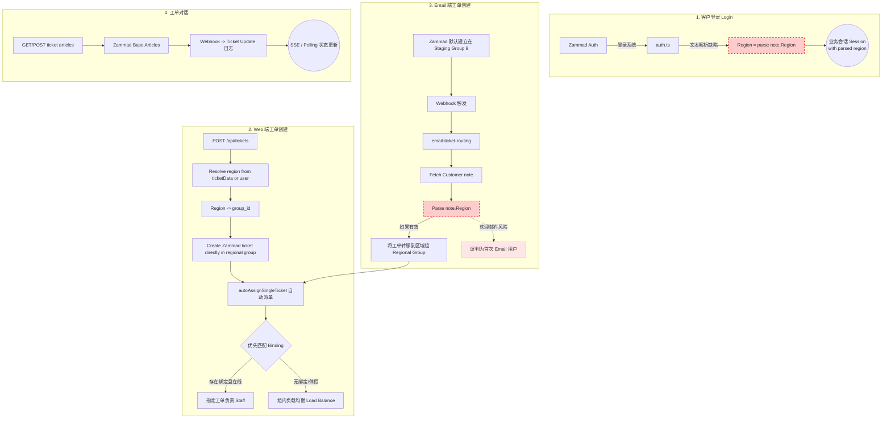
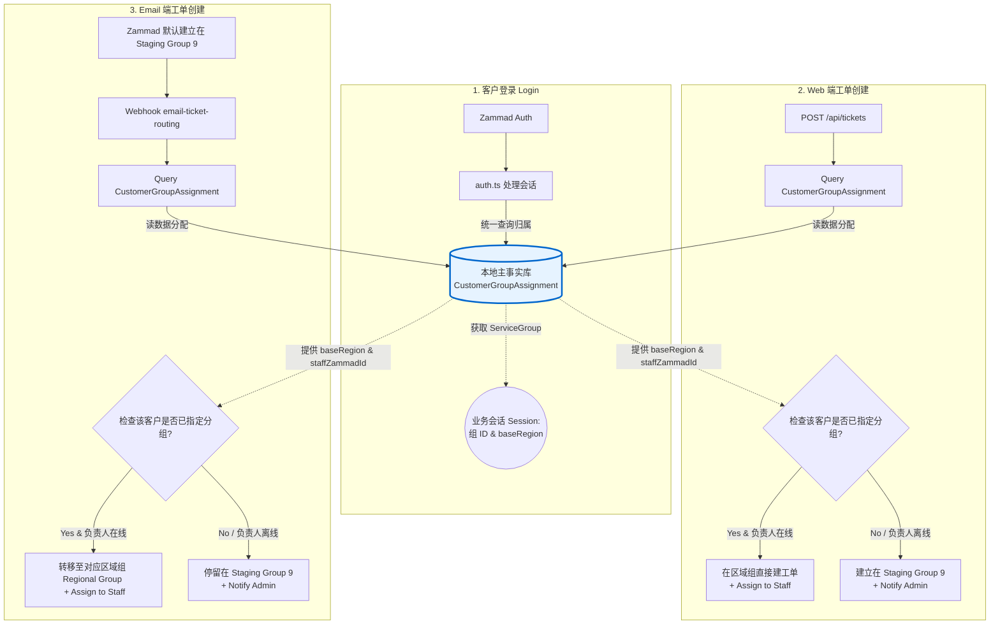

# 工单生命周期结构重构：可用性可视化

本文档提炼自 `2026-04-16-ticket-lifecycle-note-region-refactor-design.md`，使用 Mermaid 流程图直观展示了由于业务归属（`Region`）逻辑带来的旧有实现与目标架构的对比。

---

## 1. 当前真实全景图 (Current Architecture)

旧系统中，用户所属的业务区域严重依赖文本解析，这在 Web 和 Email 等端上产生了多个割裂的查询逻辑分叉。

---

## 2. 目标系统全景图 (Target Architecture)

废弃对 `note.region` 文本的强依赖之后，所有的入口（终端）将统一查询本地数据库的新建派定关系 `CustomerGroupAssignment`。

