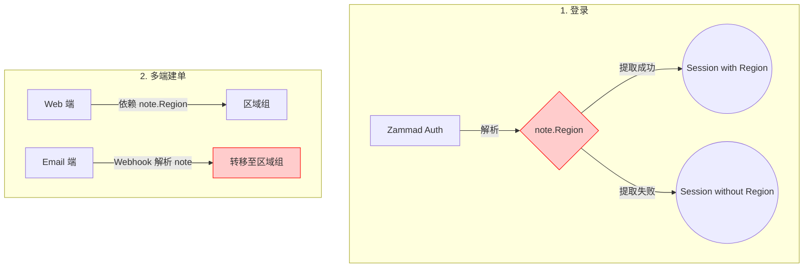
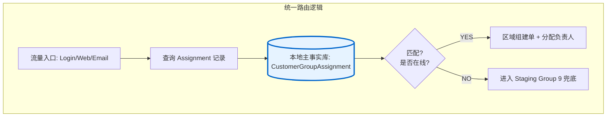

# 工单生命周期架构重构：对比可视化

这里直接展示重构前后的逻辑流对比，无需任何复杂的交互代码，直接预览即可。

## 1. 当前老旧架构 (有风险)
主要风险点在于依赖 `note.Region` 字符串解析，逻辑极其脆弱。

---

## 2. 目标重构架构 (稳健)
统一使用 `CustomerGroupAssignment` 数据库记录作为唯一的事实来源。

### 重构核心变动：
1. **去中心化 -> 归口管理**：所有从 `note.Region` 拿数据的逻辑全部废弃。
2. **引入 Staging**：无法自动归类的工单统一进入 Group 9，由管理员处理，彻底解决“空区域”报错。
3. **精准到人**：以前只能分到组，现在支持直接通过数据库绑定 Staff ID。
